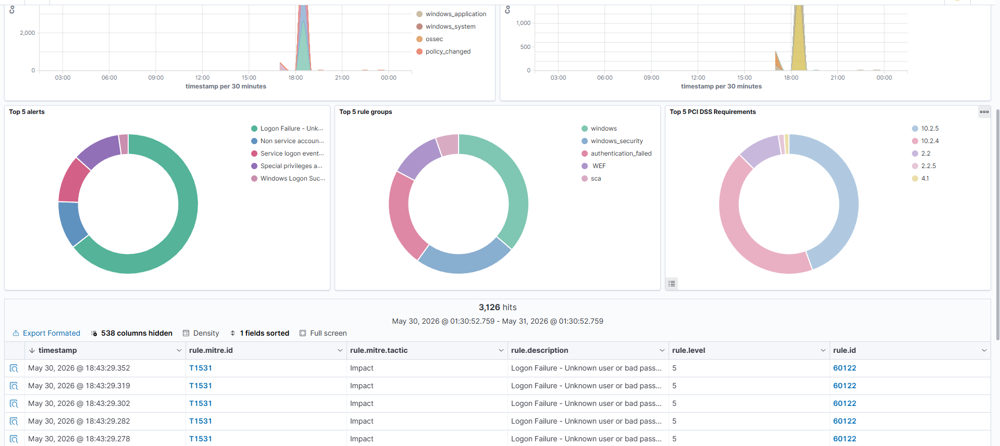
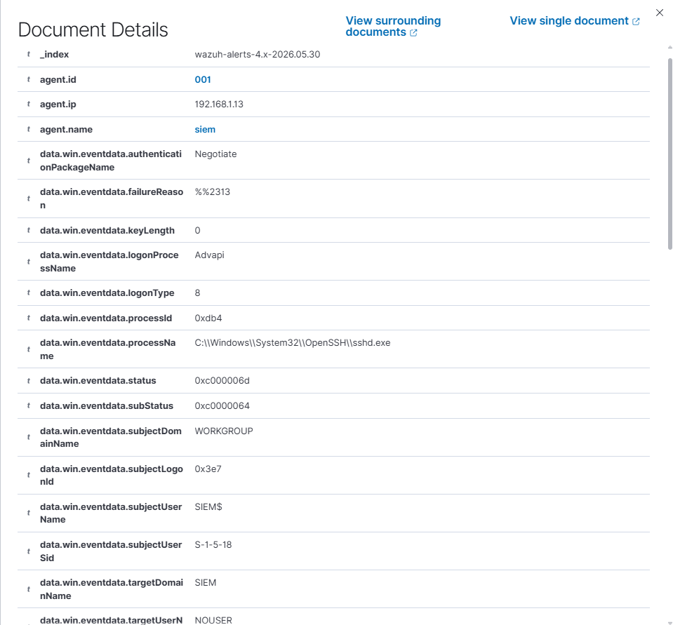
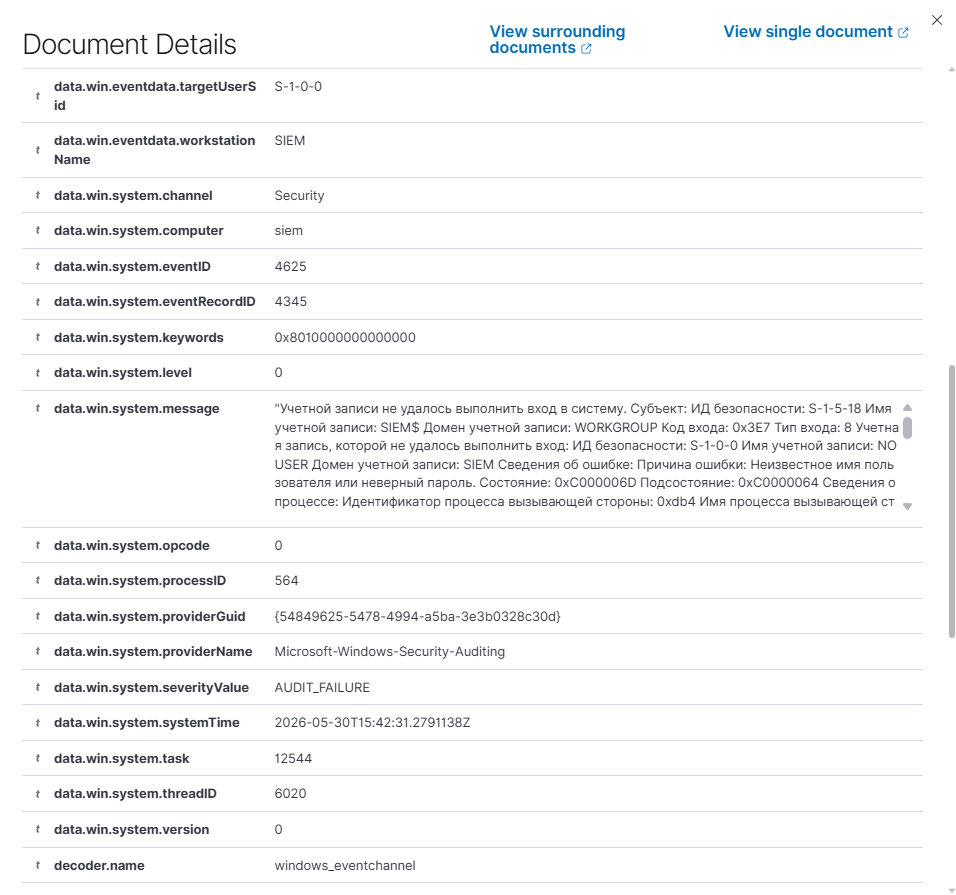
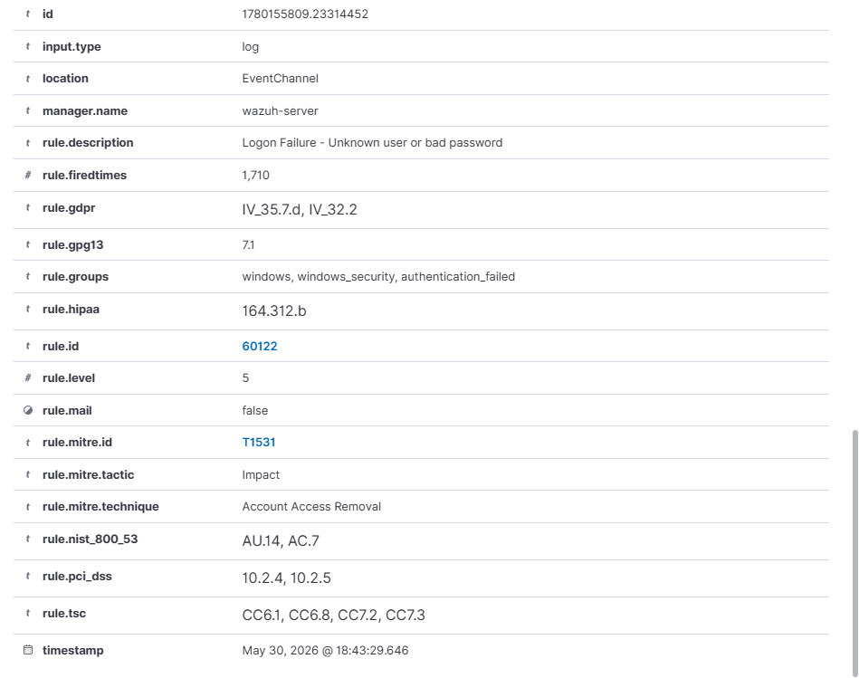
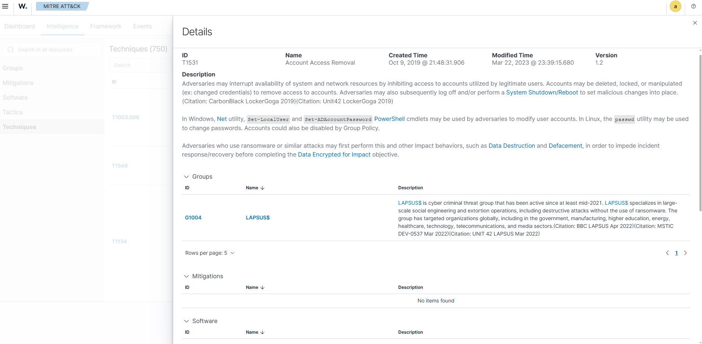
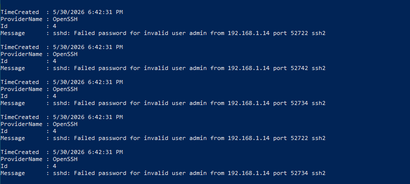

# Знакомство с Wazuh: установка, агенты, детектирование атак

Развернул Wazuh SIEM в виртуалках, чтобы на практике посмотреть как работает мониторинг безопасности.

## Что использовал

- Wazuh 4.9 (SIEM-сервер) на Ubuntu - готовая OVA
- Windows 10 - на ней агент Wazuh, собирает логи
- Kali Linux - с неё атакую Windows
- VirtualBox, все машины в одной сети

## Что сделал

- Развернул Wazuh из OVA, настроил веб-дашборд
- Подключил агента на Windows - логи пошли в SIEM
- С Kali провёл брутфорс SSH на Windows через Hydra
- Увидел алерты в Wazuh, проанализировал их

## Что получилось

После запуска Hydra с Kali на Windows в Wazuh появились алерты:
- Правило 60122 - Logon Failure (неудачный вход)
- 1710+ срабатываний за пару минут
- Event ID 4625, пользователи NOUSER (несуществующие)
- Процесс sshd.exe

Вывод: брутфорс SSH. Не ложное срабатывание.

## Что заметил

- В алерте не было IP атакующего. В реальности IP можно найти в логах sshd на хосте.
- Стандартное правило 60122 ссылается на MITRE T1531 (Account Access Removal), хотя по сути это T1110.001 (Brute Force). Значит правила надо проверять, не всё корректно из коробки.

## Что понял

- SIEM видит атаки если агенты настроены и логи идут
- Алерты нужно анализировать
- Wazuh собирает логи, алерты и данные с хостов. Но для управления инцидентами нужна отдельная система типа TheHive
- Без тикет-системы сложно понять какие алерты уже разобраны, а какие новые

## Скриншоты

Общий вид дашборда Wazuh с алертами после брутфорса:

Детали алерта - Event ID, пользователь, процесс

Вкладка MITRE ATT&CK в Wazuh:

Логи OpenSSH на Windows - тут уже видно IP атакующего:

## Инструменты

`Wazuh` `MITRE ATT&CK` `Hydra` `VirtualBox` `Linux` `Windows`
