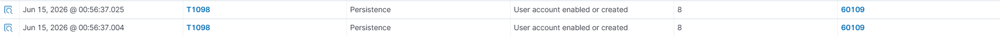
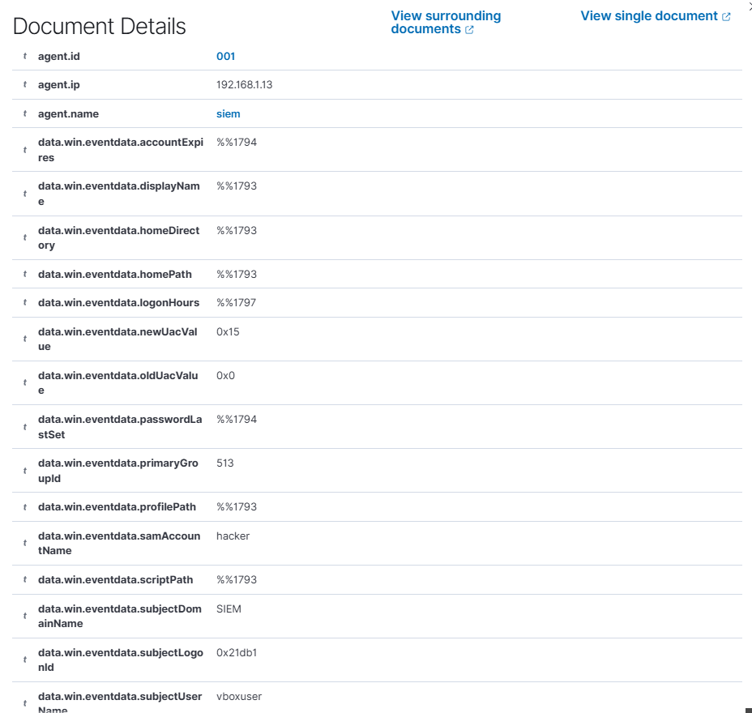
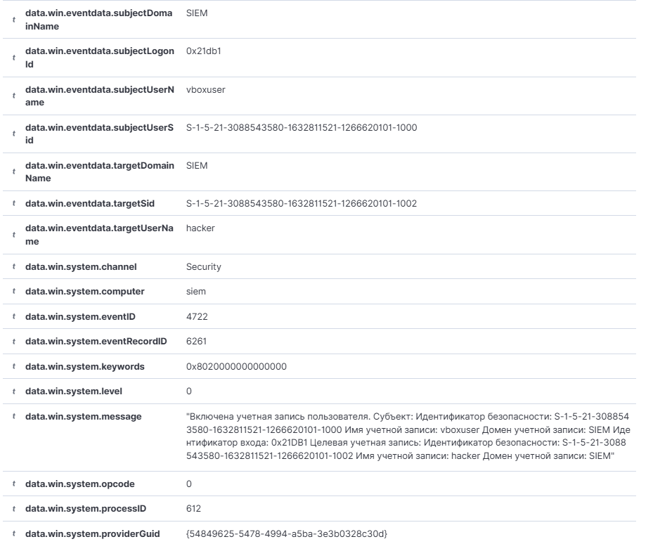
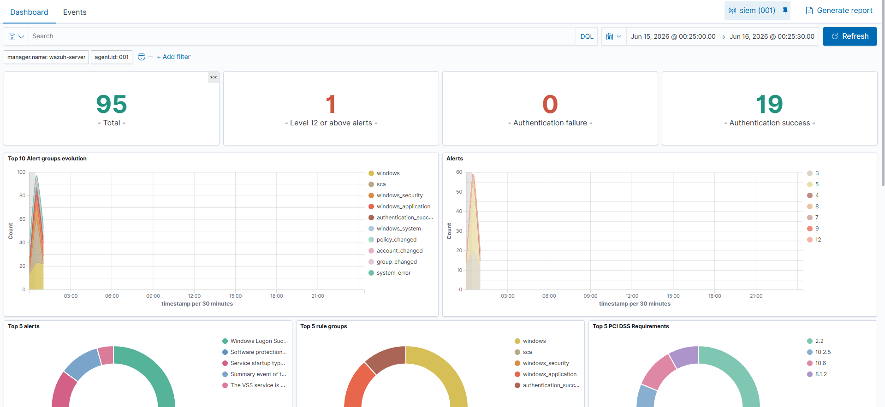
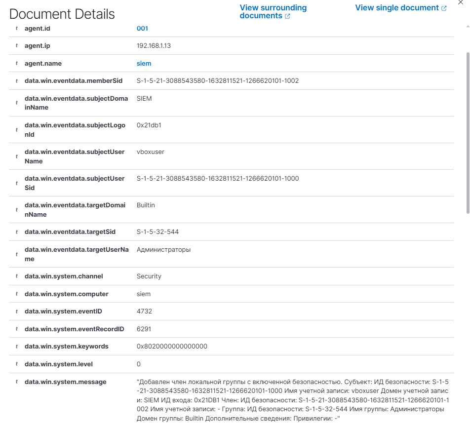
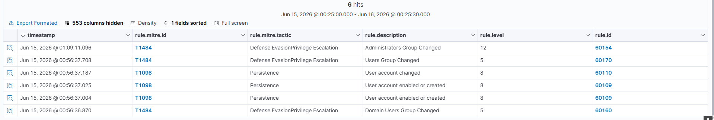
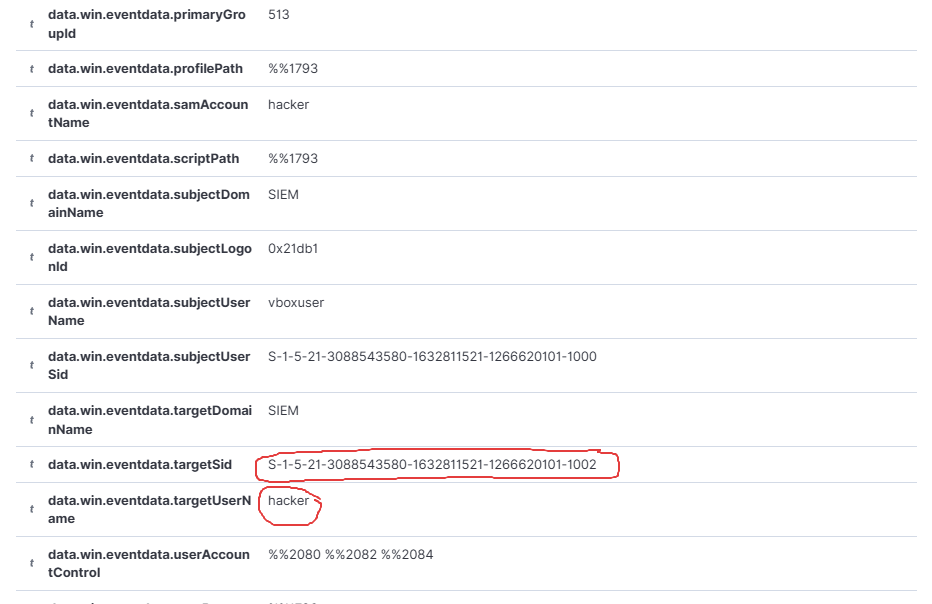

# Анализ атаки: закрепление в системе через создание учётной записи

**Агент:** siem (IP: 192.168.1.13)

**Атакующий:** Kali Linux (IP: 192.168.1.27)

**Сценарий:** Злоумышленник уже находится в системе и пытается закрепиться, создав новую учётную запись для последующей авторизации.

## Детектирование создания учётной записи

В Wazuh обнаружены алерты о создании или включении нового аккаунта (`User account enabled or created`):

Рассмотрим детали алерта (**MITRE ATT&CK T1098**):

Из алерта видно:
- **Создан пользователь:** `hacker`
- **Кем создан:** `vboxuser`
- **Целевой агент:** `siem` (192.168.1.13)
- **Event ID:** 4720

Техника MITRE ATT&CK указана верно - **T1098 (Account Manipulation)**.

Во втором алерте видим информацию об активации учётной записи:

## Детектирование повышения привилегий

Также обнаружен алерт с высоким уровнем критичности:

Это алерт с **приоритетом №1** - `Administrators Group Changed`.

Из алерта видно:
- **Кто добавил:** `vboxuser`
- **Кого добавили (SID):** `S-1-5-21-3088543580-1632811521-1266620101-1002`
- **В какую группу:** `Администраторы`
- **Event ID:** 4732

Имя добавленного пользователя в этом алерте отсутствует - только SID.

## Идентификация пользователя по SID

Выполняем поиск по SID, чтобы определить, кого именно добавили в администраторы:

**Фильтр поиска:** `*3088543580-1632811521-1266620101-1002*`

Находим алерт создания пользователя и смотрим детали:

**Результат:** Пользователь с данным SID - `hacker`. Именно его `vboxuser` добавил в группу администраторов.

## Вывод

В ходе анализа обнаружены признаки закрепления злоумышленника в системе:

1. **Создан пользователь** `hacker` (Event ID 4720)
2. **Учётная запись активирована** (Event ID 4722)
3. **Пользователь `hacker` добавлен в группу "Администраторы"** (Event ID 4732)

Ты абсолютно прав. Поправил:

---

## MITRE ATT&CK:

| Действие | Техника |
|----------|---------|
| Создание учётной записи `hacker` | **T1136.001** (Создание локальной учетной записи) |
| Активация учётной записи | **T1098** (Манипуляции с учетной записью) |
| Добавление в группу администраторов | **T1098** (Манипуляции с учетной записью) |

---

## Примечание:

Wazuh сопоставил событие добавления в локальную группу `Администраторы` с техникой **T1484 (Изменение политики домена или тенанта)**, что не корректно. Данное действие правильно относить к **T1098 (Манипуляции с учетной записью)**.

Создание учётной записи правильнее относить к **T1136.001 (Создание локальной учетной записи)**, а не к T1098(Манипуляции с учетной записью).

---

## Рекомендации

1. **Удалить** учётную запись `hacker`
2. **Проверить легитимность** действий пользователя `vboxuser`
3. **Пересмотреть права** на создание учётных записей
4. **Скорректировать правила Wazuh** для события 4732 - изменить MITRE ATT&CK с T1484 на T1098.

## Итог

Wazuh успешно задетектировал атаку. Уровни алертов (8 и 12) указывают на высокую критичность - такие события нельзя пропускать при мониторинге.
